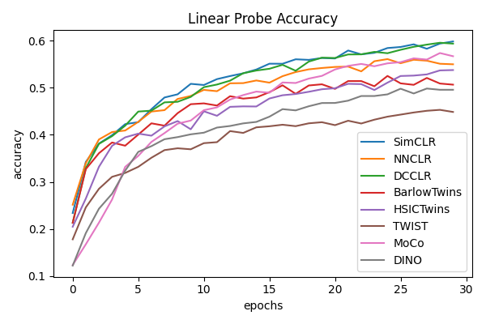
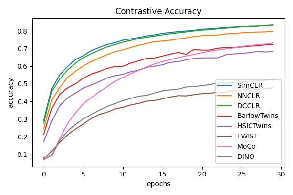

# Self-supervised Contrastive Learning for Image Classification with Keras

This repository contains an implementation for 3 self-supervised instance-level (image-level) contrastive learning methods:
- [SimCLR](https://arxiv.org/abs/2002.05709)
- [MoCo](https://arxiv.org/abs/1911.05722) ([v2](https://arxiv.org/abs/2003.04297), [v3](https://arxiv.org/abs/2104.02057))
- [BarlowTwins](https://arxiv.org/abs/2103.03230)

The codebase follows modern Tensorflow2 + Keras best practices and the implementation seeks to be as concise and readable as possible. The codebase is well commented, and has self-explanatory naming. This implementation is intended to be used as an easy-to-use baseline instead of as a line-by-line reproduction of the papers. 

Training each algorithm takes appr. 30 minutes in a Colab Notebook: 

## Design choices:
- simple and easy-to-read implementation over accuracy to the finest implementation details
- simple feedforward convolutional architecture: 
    - the methods have to be robust enough to work on simple arhitectures as well
    - this enables the usage of larger batch sizes
    - the shorter training time enables more thorough hyperparameter tuning so that the comparison is fairer
- no batchnorm layers used for benchmarking: as reported in [CPCv2](https://arxiv.org/abs/1905.09272) and [MoCo](https://arxiv.org/abs/1911.05722), it introduces an intra-batch dependency between samples, which can hurt performance
- only the most important image augmentations are used, to avoid having too much hyperparameters:
    - random horizontal flip: introduces the prior that the horizontal directions are more interchangeable than the vertical ones
    - random resized crop: forces the model to encode different parts of the same image similarly
    - random color jitter: prevents a trivial color histogram-based solution to the task by distorting color histograms

## Results

